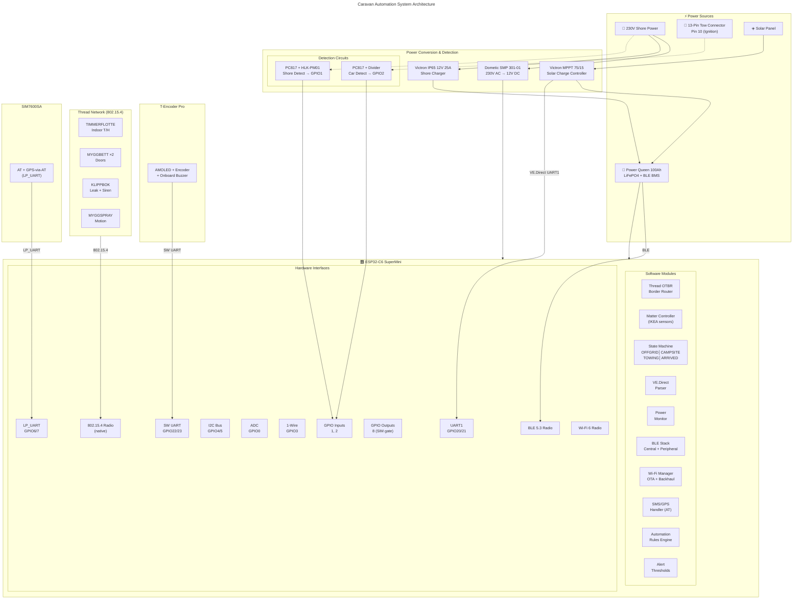
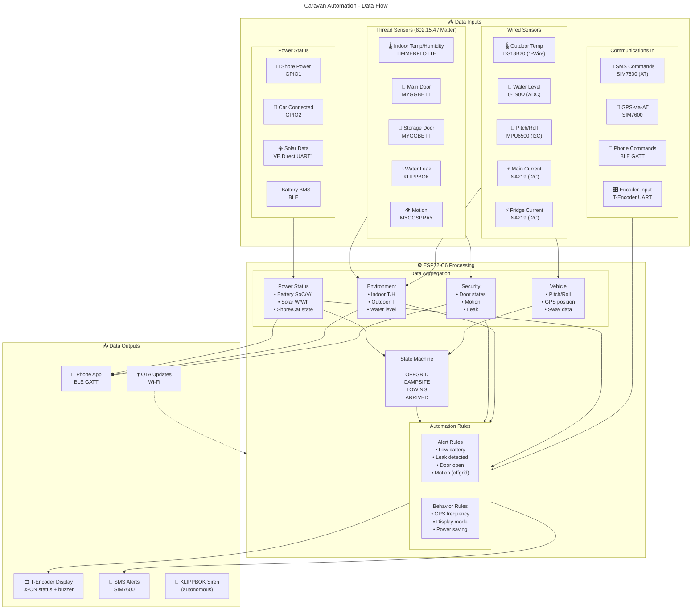
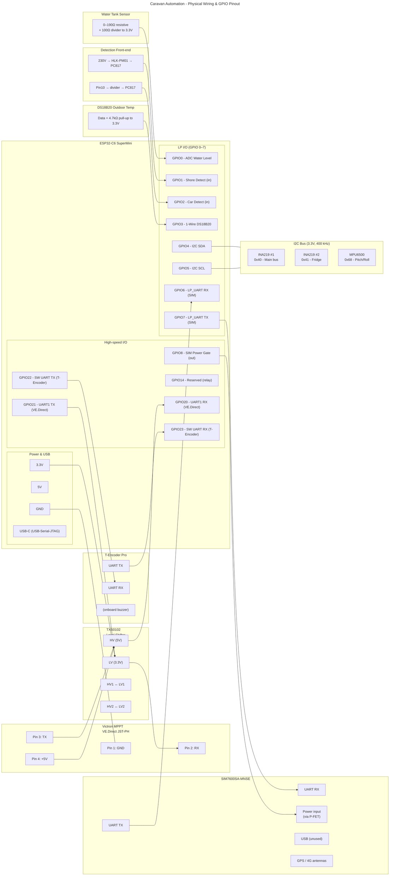

# ESP32-C6 Architecture Pivot — Implementation Plan

> **For agentic workers:** REQUIRED SUB-SKILL: Use superpowers:subagent-driven-development (recommended) or superpowers:executing-plans to implement this plan task-by-task. Steps use checkbox (`- [ ]`) syntax for tracking.

**Goal:** Pivot the repository from the merged ESP32-S3 + XIAO nRF52840 architecture to a single ESP32-C6 SuperMini, leaving the codebase in a clean state with a working "hello world" firmware skeleton ready for per-module feature development.

**Architecture:** Delete the obsolete `xiao-rcp/` subsystem; replace the empty `esp32-hub/` placeholder with an ESP-IDF v6.0 project at `c6-hub/`; add a minimal `main.c` that prints chip + boot info to confirm the toolchain ↔ flash ↔ console pipeline works end-to-end on the existing 4 MB ESP32-C6FH4 SuperMini; rewrite README and mermaid diagrams to match the new architecture.

**Tech Stack:** ESP-IDF v6.0, ESP32-C6 RISC-V toolchain, USB-Serial-JTAG flashing, Mermaid for diagrams.

**Spec reference:** `docs/superpowers/specs/2026-04-25-c6-single-mcu-design.md`.

---

## File Structure

```
docs/
├── architecture.mermaid          MODIFY — replace S3+XIAO with single C6
├── dataflow.mermaid              MODIFY — replace ESP32-S3 Processing label
├── wiring.mermaid                MODIFY — full GPIO remap, drop XIAO/level-shifter for RCP
├── state_machine.mermaid         (unchanged — state logic is hardware-agnostic)
└── superpowers/
    ├── plans/2026-04-25-c6-pivot-implementation.md   THIS FILE
    └── specs/2026-04-25-c6-single-mcu-design.md       (already committed)

c6-hub/                           NEW — replaces empty esp32-hub/ placeholder
├── CMakeLists.txt                NEW — top-level ESP-IDF project
├── partitions.csv                NEW — single-app-slot layout for 4 MB
├── sdkconfig.defaults            NEW — pinned target + flash size
├── main/
│   ├── CMakeLists.txt            NEW
│   └── main.c                    NEW — prints chip info, boot counter
├── build.sh                      NEW — sources ESP-IDF export.sh, runs idf.py
├── flash.sh                      NEW — wrapper around idf.py flash + monitor
└── .gitignore                    NEW — ignores build/, sdkconfig (local)

esp32-hub/                        DELETE — empty placeholder, superseded by c6-hub/
xiao-rcp/                         DELETE — entire directory
README.md                         MODIFY — substantial rewrite
```

The `esp32-hub/` placeholder we created in commit `d7bc21e` is empty and gets replaced by `c6-hub/`. The `xiao-rcp/` subsystem we built yesterday is dead architecture and gets fully deleted — git history retains it for reference.

---

## Key Decisions Locked In

| Decision | Value |
|---|---|
| ESP-IDF version | **v6.0** (released March 2026, current stable, includes mature C6 support) |
| ESP-IDF install location | `~/esp/esp-idf-v6.0/` (Espressif's recommended layout) |
| Tools install location | `~/.espressif/` (created automatically by `install.sh`) |
| Target chip | `esp32c6` |
| Flash size | 4 MB on bring-up board (ESP32-C6FH4); migration plan to 16 MB documented |
| Partition table | Single-app-slot (`partitions.csv`) — fits 4 MB and any larger flash |
| Console | USB-Serial-JTAG (built-in to C6, no external bridge) |
| Project path | `c6-hub/` |

---

## Task 1: Delete the obsolete subsystems

**Files:**
- Delete: `xiao-rcp/` (entire directory)
- Delete: `esp32-hub/` (empty placeholder)

- [ ] **Step 1: Confirm what's about to be deleted**

Run:
```bash
cd /Users/maidok/Developer/powerqueen
ls xiao-rcp/ esp32-hub/ 2>&1
```
Expected: `xiao-rcp/` lists files (README.md, build.sh, prj.conf, boards/, .gitignore); `esp32-hub/` is empty or contains only `main/`.

- [ ] **Step 2: Delete both directories**

Run:
```bash
rm -rf xiao-rcp esp32-hub
```

- [ ] **Step 3: Verify both are gone**

Run:
```bash
ls xiao-rcp esp32-hub 2>&1 | head -3
```
Expected: `ls: xiao-rcp: No such file or directory` and `ls: esp32-hub: No such file or directory`.

- [ ] **Step 4: Commit the deletion**

Run:
```bash
git add -A
git commit -m "$(cat <<'EOF'
xiao-rcp: drop two-MCU architecture in favor of single ESP32-C6

The architecture pivot from ESP32-S3 + XIAO nRF52840 RCP to a single
ESP32-C6 SuperMini makes both subsystems obsolete:

- xiao-rcp/: Zephyr-based Thread RCP firmware. Superseded by the C6's
  native 802.15.4 radio. The build scaffold and overlay are no longer
  reachable from any current code path.

- esp32-hub/: empty placeholder for the planned ESP-IDF firmware on the
  S3. Replaced by c6-hub/ in the next commit.

Spec: docs/superpowers/specs/2026-04-25-c6-single-mcu-design.md
EOF
)"
```

---

## Task 2: Install ESP-IDF v6.0

**Files:** None — installs to `~/esp/esp-idf-v6.0/` and `~/.espressif/`, both outside the repo.

- [ ] **Step 1: Create the install directory and clone ESP-IDF**

Run:
```bash
mkdir -p ~/esp
cd ~/esp
git clone -b v6.0 --recursive --depth 1 https://github.com/espressif/esp-idf.git esp-idf-v6.0
```
Expected: clone completes (~250 MB shallow with submodules, takes 2–5 min on fast internet).

- [ ] **Step 2: Run the install script for the C6 target only**

Run:
```bash
cd ~/esp/esp-idf-v6.0
./install.sh esp32c6
```
Expected: downloads RISC-V toolchain + Python venv to `~/.espressif/`, finishes with "All done! You can now run...". Takes 5–10 min.

- [ ] **Step 3: Source the export script and verify idf.py is on PATH**

Run:
```bash
. ~/esp/esp-idf-v6.0/export.sh
idf.py --version
```
Expected: prints `ESP-IDF v6.0` (or `v6.0-something`).

- [ ] **Step 4: No commit**

System-level install lives outside the repo.

---

## Task 3: Scaffold the c6-hub ESP-IDF project

**Files:**
- Create: `c6-hub/CMakeLists.txt`
- Create: `c6-hub/main/CMakeLists.txt`
- Create: `c6-hub/main/main.c`
- Create: `c6-hub/sdkconfig.defaults`
- Create: `c6-hub/partitions.csv`
- Create: `c6-hub/build.sh`
- Create: `c6-hub/flash.sh`
- Create: `c6-hub/.gitignore`

- [ ] **Step 1: Create the top-level project CMakeLists.txt**

Create `c6-hub/CMakeLists.txt` with content:
```cmake
cmake_minimum_required(VERSION 3.16)

include($ENV{IDF_PATH}/tools/cmake/project.cmake)

project(c6-hub)
```

- [ ] **Step 2: Create the main component CMakeLists.txt**

Create `c6-hub/main/CMakeLists.txt` with content:
```cmake
idf_component_register(
    SRCS "main.c"
    INCLUDE_DIRS "."
)
```

- [ ] **Step 3: Create main.c (hello world that prints chip info + boot counter)**

Create `c6-hub/main/main.c` with content:
```c
#include <stdio.h>
#include <inttypes.h>
#include "freertos/FreeRTOS.h"
#include "freertos/task.h"
#include "esp_chip_info.h"
#include "esp_flash.h"
#include "esp_mac.h"
#include "esp_log.h"

static const char *TAG = "caravan";

static void log_chip_info(void)
{
    esp_chip_info_t chip;
    esp_chip_info(&chip);

    uint32_t flash_size = 0;
    esp_flash_get_size(NULL, &flash_size);

    uint8_t mac[8] = {0};
    esp_read_mac(mac, ESP_MAC_IEEE802154);

    ESP_LOGI(TAG, "model=%d cores=%d revision=%d.%d",
             chip.model, chip.cores,
             chip.revision / 100, chip.revision % 100);
    ESP_LOGI(TAG, "features: WiFi=%d BT=%d BLE=%d 802.15.4=%d",
             (chip.features & CHIP_FEATURE_WIFI_BGN) != 0,
             (chip.features & CHIP_FEATURE_BT) != 0,
             (chip.features & CHIP_FEATURE_BLE) != 0,
             (chip.features & CHIP_FEATURE_IEEE802154) != 0);
    ESP_LOGI(TAG, "flash=%" PRIu32 " bytes (%" PRIu32 " MB)",
             flash_size, flash_size / (1024 * 1024));
    ESP_LOGI(TAG, "ieee802154 mac=%02x:%02x:%02x:%02x:%02x:%02x:%02x:%02x",
             mac[0], mac[1], mac[2], mac[3],
             mac[4], mac[5], mac[6], mac[7]);
}

void app_main(void)
{
    ESP_LOGI(TAG, "boot");
    log_chip_info();

    uint32_t tick = 0;
    while (true) {
        ESP_LOGI(TAG, "alive tick=%" PRIu32, tick++);
        vTaskDelay(pdMS_TO_TICKS(1000));
    }
}
```

- [ ] **Step 4: Create sdkconfig.defaults**

Create `c6-hub/sdkconfig.defaults` with content:
```conf
# Target chip
CONFIG_IDF_TARGET="esp32c6"

# Flash size — bring-up board is ESP32-C6FH4 (4 MB embedded). When the
# 16 MB SuperMini arrives, change this to 16MB and update partitions.csv.
CONFIG_ESPTOOLPY_FLASHSIZE_4MB=y
CONFIG_ESPTOOLPY_FLASHSIZE="4MB"

# Custom partition table (single app slot — see partitions.csv)
CONFIG_PARTITION_TABLE_CUSTOM=y
CONFIG_PARTITION_TABLE_CUSTOM_FILENAME="partitions.csv"

# USB-Serial-JTAG console — the SuperMini has no external UART bridge
CONFIG_ESP_CONSOLE_USB_SERIAL_JTAG=y

# Logging
CONFIG_LOG_DEFAULT_LEVEL_INFO=y
CONFIG_LOG_COLORS=y
```

- [ ] **Step 5: Create the partition table**

Create `c6-hub/partitions.csv` with content:
```csv
# Name,   Type, SubType, Offset,  Size,    Flags
nvs,      data, nvs,     0x9000,  0x6000,
phy_init, data, phy,     0xf000,  0x1000,
factory,  app,  factory, 0x10000, 3M,
```

This single-app-slot layout fits comfortably in 4 MB and leaves room to grow the app to ~3 MB. When the 16 MB board arrives, this file gets replaced with a dual-OTA layout.

- [ ] **Step 6: Create the build script**

Create `c6-hub/build.sh` with content:
```bash
#!/usr/bin/env bash
# Build the c6-hub firmware for ESP32-C6.
#
# Usage:
#   ./build.sh                 # configure + build
#   ./build.sh fullclean       # wipe build directory
#   ./build.sh menuconfig      # interactive Kconfig (use with caution)

set -euo pipefail

PROJECT_DIR="$(cd "$(dirname "${BASH_SOURCE[0]}")" && pwd)"
IDF_PATH="${IDF_PATH:-$HOME/esp/esp-idf-v6.0}"

if [ ! -f "$IDF_PATH/export.sh" ]; then
  echo "error: ESP-IDF not found at $IDF_PATH. Run Task 2 of the pivot plan." >&2
  exit 1
fi

# shellcheck disable=SC1091
. "$IDF_PATH/export.sh" >/dev/null

cd "$PROJECT_DIR"

case "${1:-build}" in
  fullclean)
    idf.py fullclean
    ;;
  menuconfig)
    idf.py menuconfig
    ;;
  build|"")
    idf.py set-target esp32c6
    idf.py build
    ;;
  *)
    idf.py "$@"
    ;;
esac
```

Then make it executable:
```bash
chmod +x c6-hub/build.sh
```

- [ ] **Step 7: Create the flash script**

Create `c6-hub/flash.sh` with content:
```bash
#!/usr/bin/env bash
# Flash and monitor the c6-hub firmware on a connected ESP32-C6.
#
# Usage:
#   ./flash.sh                # auto-detect port, flash + monitor
#   ./flash.sh /dev/cu.usbmodemXXXX  # explicit port

set -euo pipefail

PROJECT_DIR="$(cd "$(dirname "${BASH_SOURCE[0]}")" && pwd)"
IDF_PATH="${IDF_PATH:-$HOME/esp/esp-idf-v6.0}"

if [ ! -f "$IDF_PATH/export.sh" ]; then
  echo "error: ESP-IDF not found at $IDF_PATH. Run Task 2 of the pivot plan." >&2
  exit 1
fi

# shellcheck disable=SC1091
. "$IDF_PATH/export.sh" >/dev/null

cd "$PROJECT_DIR"

PORT="${1:-}"
if [ -z "$PORT" ]; then
  PORT=$(ls /dev/cu.usbmodem* 2>/dev/null | head -1)
  if [ -z "$PORT" ]; then
    echo "error: no /dev/cu.usbmodem* device found. Connect the C6 via USB-C." >&2
    exit 1
  fi
  echo "info: auto-detected port $PORT"
fi

idf.py -p "$PORT" flash monitor
```

Then make it executable:
```bash
chmod +x c6-hub/flash.sh
```

- [ ] **Step 8: Create .gitignore**

Create `c6-hub/.gitignore` with content:
```
build/
sdkconfig
sdkconfig.old
managed_components/
dependencies.lock
```

`sdkconfig` is the ESP-IDF generated config — it gets regenerated from `sdkconfig.defaults` per machine, so we don't track it.

- [ ] **Step 9: Verify the scaffold is in place**

Run:
```bash
ls -la c6-hub/ c6-hub/main/
```
Expected:
- `c6-hub/`: CMakeLists.txt, build.sh (executable), flash.sh (executable), partitions.csv, sdkconfig.defaults, .gitignore, main/
- `c6-hub/main/`: CMakeLists.txt, main.c

- [ ] **Step 10: Commit the scaffold**

Run:
```bash
git add c6-hub/
git commit -m "$(cat <<'EOF'
c6-hub: ESP-IDF v6.0 project scaffold for ESP32-C6 SuperMini

Minimal hello-world that prints chip info, feature flags, flash size,
IEEE 802.15.4 MAC, and a per-second boot counter. Targets esp32c6 with
USB-Serial-JTAG console. Single-app-slot partition table for the 4 MB
bring-up board; will switch to dual-OTA when the 16 MB SuperMini arrives.

build.sh and flash.sh wrap idf.py — same pattern as xiao-rcp/build.sh
in the previous architecture: source the toolchain export script, then
run the build/flash. No interactive shell needed.
EOF
)"
```

---

## Task 4: First build of the hello-world firmware

**Files:** Produces `c6-hub/build/c6-hub.bin`, `c6-hub/build/c6-hub.elf` (gitignored).

- [ ] **Step 1: Run the build**

Run:
```bash
cd /Users/maidok/Developer/powerqueen/c6-hub
./build.sh
```
Expected output ends with something like:
```
Project build complete. To flash, run:
 idf.py flash
or
 idf.py -p PORT flash
```
First build takes 2–4 minutes (compiles ESP-IDF components).

- [ ] **Step 2: Verify build artifacts exist**

Run:
```bash
ls -la c6-hub/build/c6-hub.bin c6-hub/build/c6-hub.elf c6-hub/build/partition_table/partition-table.bin
```
Expected: all three files present, `c6-hub.bin` somewhere in the 100–300 KB range.

- [ ] **Step 3: Sanity-check the binary's target chip**

Run:
```bash
. ~/esp/esp-idf-v6.0/export.sh >/dev/null
esptool.py --chip esp32c6 image_info c6-hub/build/c6-hub.bin 2>&1 | head -20
```
Expected: image header prints, "Chip: ESP32-C6", entry point address, valid checksum.

- [ ] **Step 4: No commit**

Build artifacts are gitignored.

---

## Task 5: Flash the firmware to the C6 SuperMini

**Files:** None — physical action on hardware.

**Before you start:** The C6 SuperMini should be plugged in via USB-C and recognized as `/dev/cu.usbmodemXXXX` (verify with `ls /dev/cu.usbmodem*`).

- [ ] **Step 1: Run the flash script**

Run:
```bash
cd /Users/maidok/Developer/powerqueen/c6-hub
./flash.sh
```
Expected: esptool detects the chip, erases the relevant flash regions, writes bootloader + partition table + app, resets the chip, then attaches the monitor. Total time ~30 seconds.

If it fails with "Failed to connect to ESP32-C6: No serial data received":
- Hold the BOOT button while pressing RESET, release RESET, release BOOT (forces download mode).
- Re-run `./flash.sh`.

- [ ] **Step 2: Confirm boot output**

Inside the monitor, the serial output should show:
```
I (xxx) caravan: boot
I (xxx) caravan: model=8 cores=1 revision=0.1
I (xxx) caravan: features: WiFi=1 BT=0 BLE=1 802.15.4=1
I (xxx) caravan: flash=4194304 bytes (4 MB)
I (xxx) caravan: ieee802154 mac=e4:b0:63:ff:fe:41:ee:70 (or similar)
I (xxx) caravan: alive tick=0
I (1xxx) caravan: alive tick=1
I (2xxx) caravan: alive tick=2
```

Press `Ctrl-]` to exit the monitor.

- [ ] **Step 3: No commit**

Hardware flash, no repo change.

---

## Task 6: Update mermaid diagrams

**Files:**
- Modify: `docs/architecture.mermaid`
- Modify: `docs/dataflow.mermaid`
- Modify: `docs/wiring.mermaid`
- Unchanged: `docs/state_machine.mermaid` (state logic is hardware-agnostic)

- [ ] **Step 1: Rewrite docs/architecture.mermaid**

Replace the entire file content with:


- [ ] **Step 2: Rewrite docs/dataflow.mermaid**

Replace the entire file content with:


- [ ] **Step 3: Rewrite docs/wiring.mermaid**

Replace the entire file content with:


- [ ] **Step 4: Verify mermaid syntax (smoke test)**

Run:
```bash
head -1 docs/architecture.mermaid docs/dataflow.mermaid docs/wiring.mermaid
```
Expected: each file starts with `---`. (We aren't running a Mermaid parser here — visual review in your editor / GitHub is the real check.)

- [ ] **Step 5: Commit the diagrams**

Run:
```bash
git add docs/architecture.mermaid docs/dataflow.mermaid docs/wiring.mermaid
git commit -m "docs: rewrite mermaid diagrams for ESP32-C6 architecture"
```

---

## Task 7: Rewrite README.md for the new architecture

This is one logical change but touches many sections. Each step modifies a specific section.

**Files:**
- Modify: `README.md`

- [ ] **Step 1: Rewrite the Architecture Overview ASCII (around the diagram showing ESP32-S3 HUB)**

Find the block that begins with:
```
## Architecture Overview

```
┌─────────────────────────────────────────────────────────────────┐
│                        ESP32-S3 HUB                             │
```

Replace the entire ASCII block (everything between the opening `\`\`\`` after "## Architecture Overview" and the closing `\`\`\`` before "---") with:
```
┌─────────────────────────────────────────────────────────────────┐
│                    ESP32-C6 SuperMini HUB                       │
│                                                                 │
│  ┌────────┐ ┌────────┐ ┌────────┐ ┌────────┐ ┌────────┐         │
│  │ Thread │ │ Matter │ │ Wi-Fi  │ │  BLE   │ │ State  │         │
│  │  OTBR  │ │  Ctrl  │ │ + OTA  │ │  C+P   │ │Machine │         │
│  └────┬───┘ └────┬───┘ └────────┘ └────┬───┘ └────────┘         │
│       │          │                     │                        │
│  ┌────┴──────────┴───┐  ┌──────────────┴───┐  ┌────────┐        │
│  │ 802.15.4 Radio    │  │ BLE 5.3 Radio    │  │ VE.Dir │        │
│  │ (native)          │  │                  │  │ Parser │        │
│  └────┬──────────────┘  └────┬─────────────┘  └────┬───┘        │
└───────┼──────────────────────┼─────────────────────┼────────────┘
        │                      │                     │
        ▼                      ▼                     ▼
   ┌─────────┐            ┌─────────┐           ┌─────────┐
   │  IKEA   │            │ Power   │           │ Victron │
   │ Thread  │            │ Queen   │           │  MPPT   │
   │ Sensors │            │  BMS    │           │VE.Direct│
   └─────────┘            └─────────┘           └─────────┘
```

- [ ] **Step 2: Rewrite the Hardware Components table**

Find the table starting with `| Component | Purpose | Interface |`. Replace the rows for ESP32-S3, XIAO, and Buzzer (and any "Buzzer" mention in MPU6500 row). Final table:

```markdown
| Component | Purpose | Interface |
|-----------|---------|-----------|
| ESP32-C6 SuperMini | Main controller (Thread + Wi-Fi + BLE + Matter) | — |
| T-Encoder Pro | AMOLED display + rotary encoder + buzzer | UART (JST) |
| SIM7600SA-MNSE | 4G LTE + GPS | UART (AT mode + GPS-via-AT) |
| MPU6500 | Gyroscope/accelerometer | I2C |
| Victron MPPT 75/15 | Solar charge controller | VE.Direct |
| Victron IP65 12V 25A | Shore power charger | — |
| Power Queen 100Ah | LiFePO4 battery with BLE BMS | BLE |
| Dometic SMP 301-01 | 230V AC → 12V DC | — |
| 13-pin Euro connector | Tow vehicle interface | — |
| Water level gauge | 0-190Ω resistive | ADC |
| SimBase data SIM | 4G connectivity | — |
| INA219 ×2 | Current/power monitor (main bus, fridge) | I2C |
| PC817 ×3 | Optocoupler isolation (shore/car detect) | GPIO |
| HLK-PM01 | 230V AC → 5V DC for shore detection | — |
| AO3401 | P-channel MOSFET, SIM7600 power gate | GPIO |
| TXS0102 | Bidirectional level shifter (VE.Direct) | — |
| DS18B20 | Waterproof outdoor temp sensor | 1-Wire |
| IKEA TIMMERFLOTTE | Indoor temp/humidity | Thread |
| IKEA MYGGBETT ×2 | Door/window sensor | Thread |
| IKEA KLIPPBOK | Water leak sensor (built-in siren) | Thread |
| IKEA MYGGSPRAY | Motion sensor | Thread |
| Resistors, JST-PH connectors, prototype PCB | Assembly | — |
```

- [ ] **Step 3: Rewrite the GPIO Assignments table**

Find the table starting with `| GPIO | Function | Direction | Protocol | Notes |`. Replace the entire body with:

```markdown
| GPIO | Function | Direction | Protocol | Notes |
|------|----------|-----------|----------|-------|
| 0 | Water level | Input | ADC | A0, voltage divider |
| 1 | Shore power detect | Input | GPIO | Active LOW (PC817) |
| 2 | Car connection detect | Input | GPIO | Active LOW (PC817) |
| 3 | DS18B20 outdoor temp | Bidir | 1-Wire | 4.7 kΩ pull-up to 3.3V |
| 4 | I2C SDA | Bidir | I2C | INA219 ×2, MPU6500 |
| 5 | I2C SCL | Output | I2C | 400 kHz |
| 6 | LP_UART RX | Input | UART | SIM7600 → C6 |
| 7 | LP_UART TX | Output | UART | C6 → SIM7600, 115200 baud |
| 8 | SIM7600 power gate | Output | GPIO | AO3401 P-FET (disables onboard RGB LED) |
| 14 | Reserved | — | — | Future relay channel |
| 20 | UART1 RX | Input | UART | VE.Direct from MPPT, 19200 baud |
| 21 | UART1 TX | Output | UART | VE.Direct via TXS0102 level shifter |
| 22 | T-Encoder TX | Output | SW UART | JST connector to display |
| 23 | T-Encoder RX | Input | SW UART | 115200 baud |
| USB | USB-Serial-JTAG | — | USB | Flashing + console + JTAG |
| BLE | Power Queen + Phone | — | BLE 5.3 | Central + Peripheral |
| RF | IKEA sensors | — | 802.15.4 | Native, Matter-over-Thread |

**Reserved / cannot use:** GPIO 9 (BOOT button), 12, 13 (USB D-/D+), 15 (status LED), 18, 19 (internal SPI flash).
```

- [ ] **Step 4: Update the Detection Circuits section to reference C6 GPIO numbers**

Find the section `### Shore Power Detection (230V AC)` and update the GPIO references. Specifically, find:
```
3.3V ──► 10kΩ pull-up ──┬──► GPIO17
```
Change to:
```
3.3V ──► 10kΩ pull-up ──┬──► GPIO1
```

And in the same block:
```
Logic: Shore ON → GPIO17 LOW | Shore OFF → GPIO17 HIGH
```
Change to:
```
Logic: Shore ON → GPIO1 LOW | Shore OFF → GPIO1 HIGH
```

Find the section `### Car Connection Detection (13-Pin Connector)`. Same edits, GPIO18 → GPIO2:
```
3.3V ──► 10kΩ pull-up ──┬──► GPIO18
```
to:
```
3.3V ──► 10kΩ pull-up ──┬──► GPIO2
```

And:
```
Logic: Car ON → GPIO18 LOW | Car OFF → GPIO18 HIGH
```
to:
```
Logic: Car ON → GPIO2 LOW | Car OFF → GPIO2 HIGH
```

Find `### Water Level Sensing`:
```
3.3V ──► 100Ω ──┬──► GPIO33 (ADC)
```
to:
```
3.3V ──► 100Ω ──┬──► GPIO0 (ADC)
```

Find `### Outdoor Temperature (DS18B20)`:
```
3.3V ──► 4.7kΩ ──┬──► GPIO21 (1-Wire data)
```
to:
```
3.3V ──► 4.7kΩ ──┬──► GPIO3 (1-Wire data)
```

- [ ] **Step 5: Update the VE.Direct Connection diagram**

Find:
```
Pin 2: RX  ◄───────── HV1 ◄──── LV1 ◄─────── GPIO5 (TX)
Pin 3: TX  ──────────► HV2 ────► LV2 ───────► GPIO6 (RX)
```
Change to:
```
Pin 2: RX  ◄───────── HV1 ◄──── LV1 ◄─────── GPIO21 (TX)
Pin 3: TX  ──────────► HV2 ────► LV2 ───────► GPIO20 (RX)
```

- [ ] **Step 6: Update the State Machine table GPIO references**

Find:
```markdown
| GPIO17 (Shore) | GPIO18 (Car) | State | Description |
```

Change to:
```markdown
| GPIO1 (Shore) | GPIO2 (Car) | State | Description |
```

- [ ] **Step 7: Update the State Behaviors table**

Find the row:
```
| Deep sleep | Aggressive | Off | Off | Off |
```

Change to:
```
| Sleep mode | Light sleep | Off | Off | Off |
```

The OFFGRID column changes from "Aggressive" to "Light sleep" because the C6 must stay reachable as the Thread router.

- [ ] **Step 8: Rewrite the Communication Protocols table**

Find the table starting with `| Link | Protocol | Speed | Purpose |`. Replace its body with:

```markdown
| Link | Protocol | Speed | Purpose |
|------|----------|-------|---------|
| C6 ↔ Victron MPPT | UART1 | 19200 | VE.Direct text protocol |
| C6 ↔ T-Encoder Pro | SW UART | 115200 | JSON status + buzzer commands |
| C6 ↔ SIM7600 | LP_UART | 115200 | AT commands, SMS, GPS-via-AT |
| C6 ↔ Power Queen | BLE | — | Proprietary BMS protocol |
| C6 ↔ Phone | BLE GATT | — | Status read, config write |
| C6 ↔ IKEA sensors | 802.15.4 (Matter) | — | Native, no RCP |
| C6 ↔ Wi-Fi AP | Wi-Fi 6 STA | — | OTA + home backhaul |
```

- [ ] **Step 9: Update the T-Encoder Pro Protocol section**

Find `### ESP32 → T-Encoder (status updates)` and change the heading to:
```markdown
### C6 → T-Encoder (status updates + buzzer)
```

Then find the JSON example block in that section. Append a new code block immediately after the existing status example, separated by a blank line:

````markdown
**Buzzer commands** (sent in addition to status updates — display fires its onboard buzzer):

```json
{"buzzer": {"pattern": "level_ok"}}
{"buzzer": {"pattern": "level_warning"}}
{"buzzer": {"pattern": "alert"}}
{"buzzer": {"freq": 2000, "duration_ms": 100}}
```
````

Also rename `### T-Encoder → ESP32 (user input)` to `### T-Encoder → C6 (user input)`.

- [ ] **Step 10: Rewrite the Power Budget table**

Find the table starting with `| Component | Active | Sleep | Duty Cycle | Average |`. Replace the entire table with:

```markdown
| State | Mode | Estimated avg current | Notes |
|-------|------|----------------------|-------|
| OFFGRID | Light sleep, Thread router awake | 30–50 mA | Conservative; instrument early in firmware |
| CAMPSITE | Active, Wi-Fi connected | 80–120 mA | Display always on |
| TOWING | Active, GPS continuous | 100–150 mA | SMS standby |
| ARRIVED | Active, similar to CAMPSITE | 80–120 mA | |

With a 100 Ah battery: roughly **80–140 days** OFFGRID standby. The previous architecture's ~520 day figure assumed the host MCU could deep-sleep, which is incompatible with running a Thread border router. These numbers will be measured and refined during firmware bring-up.
```

- [ ] **Step 11: Rewrite the Repository Layout section**

Find the `## Repository Layout` section. Replace the code block (between the opening triple-backtick and closing triple-backtick) with:

```
.
├── README.md                       # This document
│
├── c6-hub/                         # ESP-IDF v6.0 firmware (ESP32-C6)
│   ├── CMakeLists.txt
│   ├── partitions.csv              # Single-app slot for 4 MB; switches to dual-OTA on 16 MB
│   ├── sdkconfig.defaults
│   ├── build.sh                    # Wraps idf.py
│   ├── flash.sh                    # Wraps idf.py flash + monitor
│   └── main/
│       ├── CMakeLists.txt
│       ├── main.c                  # Entry point — currently boot info + heartbeat
│       ├── state_machine.c         # OFFGRID / CAMPSITE / TOWING / ARRIVED  (planned)
│       ├── thread_otbr.c           # OpenThread Border Router  (planned)
│       ├── matter_controller.c     # Matter device pairing + reads  (planned)
│       ├── wifi_manager.c          # Wi-Fi STA + OTA  (planned)
│       ├── ota_handler.c           # esp_https_ota driver  (planned)
│       ├── victron_vedirect.c      # VE.Direct parser  (planned)
│       ├── power_monitor.c         # INA219 + shore/car detect  (planned)
│       ├── sensors.c               # DS18B20, water level, MPU6500  (planned)
│       ├── ble_bms.c               # Power Queen BMS client  (planned)
│       ├── ble_server.c            # Phone-app GATT server  (planned)
│       ├── sms_handler.c           # SIM7600 AT commands  (planned)
│       ├── gps.c                   # GPS-via-AT polling  (planned)
│       ├── display_link.c          # T-Encoder UART protocol + buzzer  (planned)
│       ├── alerts.c                # Threshold monitoring  (planned)
│       ├── rules_engine.c          # Configurable automation  (planned)
│       └── config.c                # NVS storage for settings  (planned)
│
├── t-encoder-display/              # LVGL UI for T-Encoder Pro  (planned)
│   ├── main.cpp
│   ├── gauges.cpp
│   ├── level_screen.cpp
│   ├── menu.cpp
│   └── uart_protocol.cpp
│
├── docs/                           # Architecture & protocol specs
│   ├── architecture.mermaid
│   ├── state_machine.mermaid
│   ├── wiring.mermaid
│   ├── dataflow.mermaid
│   ├── protocols/
│   │   ├── powerqueen_bms.md
│   │   └── victron_instant_readout.md
│   └── superpowers/                # Specs and plans for major changes
│       ├── specs/
│       └── plans/
│
└── tools/
    └── ble-probe/                  # Python reference (Pi-based) — reverse-engineers
        ├── read_battery.py         # the BLE protocols the firmware re-implements in C.
        ├── read_victron.py         # Not part of the runtime system.
        └── victron.env.example
```

Then update the paragraph immediately after the code block. Find:
```
Module source files inside `esp32-hub/main/` and `t-encoder-display/` are
**targets to be implemented** — the directories exist but the files haven't
been created yet.
```

Change to:
```
Module source files inside `c6-hub/main/` (other than `main.c`) and
`t-encoder-display/` are **targets to be implemented** — `main.c` is a
hello-world that prints chip info; the rest will be built up module by
module, each with its own spec under `docs/superpowers/specs/`.
```

- [ ] **Step 12: Rewrite the Key Design Decisions list**

Find `## Key Design Decisions`. Replace the entire numbered list with:

```markdown
1. **Single ESP32-C6 SuperMini** — One chip handles Thread (native 802.15.4), Wi-Fi 6, BLE 5.3, and the application logic. Replaces the earlier ESP32-S3 + XIAO nRF52840 RCP design; see [`docs/superpowers/specs/2026-04-25-c6-single-mcu-design.md`](docs/superpowers/specs/2026-04-25-c6-single-mcu-design.md) for the rationale.

2. **IKEA Thread sensors over custom nodes** — Off-the-shelf Matter-over-Thread devices eliminate custom firmware, provide multi-year battery life, and simplify deployment.

3. **SIM7600 over UART (AT mode + GPS-via-AT)** — The C6 has no USB host. AT-mode polling at ~1 Hz is sufficient for the caravan use case (SMS commands, periodic GPS); avoids a second UART for raw NMEA streaming.

4. **T-Encoder Pro for display and audio** — The display module includes its own ESP32-S3, AMOLED screen, rotary encoder, and a buzzer on its GPIO17. The C6 sends JSON over UART; the display drives its own UI and sounds its own buzzer. No discrete buzzer needed on the C6.

5. **Single Victron VE.Direct** — MPPT only; IP65 charger data is redundant given shore power detection and INA219 monitoring.

6. **DS18B20 for outdoor temp** — Wired sensor is more reliable than battery-powered Thread sensor for external mounting.

7. **Power Queen BMS via BLE** — Deferred to software phase due to proprietary protocol; INA219 provides backup current measurement.

8. **Relay support pre-wired** — GPIO 14 reserved for future relay control without implementing now.

9. **Automation rules in software** — All thresholds and behaviors configurable in NVS, changeable via phone app or Wi-Fi.

10. **Wi-Fi kept active** — Used for OTA updates and home-network connectivity when parked. Drops to backhaul-only or disabled if SRAM headroom becomes a problem.
```

- [ ] **Step 13: Rewrite the Next Steps list**

Find `## Next Steps`. Replace the entire numbered list with:

```markdown
1. ~~Flash XIAO nRF52840 with OpenThread RCP firmware~~ — **obsolete after C6 pivot.**
2. **Bring up `c6-hub` hello-world firmware on the 4 MB ESP32-C6FH4** — confirm USB-Serial-JTAG flash + console + IEEE 802.15.4 MAC visible. *(this plan)*
3. **Build VE.Direct cable** with TXS0102 level shifter.
4. **Wire detection circuits** (shore power, car connection).
5. **Develop ESP32-C6 firmware modules** — each with its own spec/plan under `docs/superpowers/`. Suggested order: state_machine → power_monitor → sensors → display_link → ble_bms → thread_otbr → matter_controller → wifi_manager → sms_handler → ota_handler → alerts/rules.
6. **Pair IKEA sensors** to the Thread network (after Matter controller works).
7. **Develop T-Encoder Pro UI** (LVGL gauges, menus, buzzer patterns).
8. **Port Power Queen BLE protocol** to C (spec in [`docs/protocols/powerqueen_bms.md`](docs/protocols/powerqueen_bms.md)).
9. **Migrate to 16 MB SuperMini** when it arrives — switch `partitions.csv` to dual-OTA layout.
10. **Test and iterate.**
```

- [ ] **Step 14: Update the References list**

Find `## References`. Replace the entire bullet list with:

```markdown
- [ESP-IDF v6.0 Programming Guide (ESP32-C6)](https://docs.espressif.com/projects/esp-idf/en/stable/esp32c6/)
- [ESP Thread Border Router SDK](https://github.com/espressif/esp-thread-br)
- [ESP-Matter](https://github.com/espressif/esp-matter)
- [Victron VE.Direct Protocol](https://www.victronenergy.com/support-and-downloads/technical-information)
- [IKEA DIRIGERA Thread Sensors](https://www.ikea.com/us/en/cat/smart-sensors-47547/)
- [T-Encoder Pro GitHub](https://github.com/Xinyuan-LilyGO/T-Encoder-Pro)
- [Power Queen BMS BLE Protocol](https://github.com/dmytro-tsepilov/pq_bms_bluetooth)
```

- [ ] **Step 15: Bump the document version footer**

Find the last lines of the README:
```
*Document version: 1.0*  
*Last updated: April 2026*
```

Change to:
```
*Document version: 2.0 — single-MCU ESP32-C6 architecture*  
*Last updated: April 2026*
```

- [ ] **Step 16: Verify the README still renders sensibly**

Run:
```bash
grep -n "ESP32-S3\|XIAO\|XIAO_nRF52840\|GPIO17\|GPIO18\|GPIO33\|GPIO19\|GPIO20.*Buzzer" README.md
```
Expected: empty or only matches in historical contexts. If any S3/XIAO references remain in current-state sentences, fix them. Note: older numbers like "GPIO20" can still appear legitimately in the new layout (T-Encoder/UART1 entries) — review hits in context.

- [ ] **Step 17: Commit the README rewrite**

Run:
```bash
git add README.md
git commit -m "$(cat <<'EOF'
docs: rewrite README for ESP32-C6 single-MCU architecture

Hardware components, GPIO map, detection circuit annotations,
VE.Direct wiring, communication protocols, T-Encoder protocol
(now with buzzer commands), power budget, repository layout,
key design decisions, next steps, and references — all updated
to reflect the C6 pivot. Bumped doc version to 2.0.

Spec: docs/superpowers/specs/2026-04-25-c6-single-mcu-design.md
EOF
)"
```

---

## Self-Review

**Spec coverage:**

| Spec section | Tasks |
|---|---|
| Hardware BOM changes | Task 7 §Step 2 |
| GPIO map | Task 6 (wiring diagram) + Task 7 §Step 3 |
| Software architecture / module list | Task 7 §Step 11 |
| UART allocation | Task 7 §Step 8 |
| T-Encoder buzzer protocol addition | Task 7 §Step 9 |
| Power profile rewrite | Task 7 §Step 10 |
| Repository changes — delete xiao-rcp/ | Task 1 |
| Repository changes — rename esp32-hub → c6-hub | Tasks 1 (delete) + 3 (create) |
| Repository changes — README sections | Task 7 |
| Repository changes — mermaid diagrams | Task 6 |
| Risk: 4 MB flash → single-app slot | Task 3 §Step 5 (partitions.csv) |
| Risk: SRAM headroom (instrumentation) | Out of scope for this plan; covered in future per-module work |
| Hello-world bring-up firmware | Tasks 3, 4, 5 |
| ESP-IDF v6.0 install | Task 2 |

**Placeholder scan:** No "TBD" / "implement later" / "add error handling" residues. Forward references to future module work (state_machine.c, etc.) are explicitly labeled `(planned)` in the README rewrite, which is honest, not a placeholder.

**Type/identifier consistency check:**
- `c6-hub` used consistently across Tasks 3, 4, 5, 7.
- ESP-IDF version `v6.0` consistent across Tasks 2, 3, 4 and the README references.
- GPIO numbers: 0/1/2/3/4/5/6/7/8/14/20/21/22/23 are used consistently across the wiring diagram (Task 6), GPIO table (Task 7 §3), detection circuits (Task 7 §4), VE.Direct diagram (Task 7 §5), state machine table (Task 7 §6).
- Partition table filename `partitions.csv` consistent between `sdkconfig.defaults` and the file itself.
- `IDF_PATH` env var used consistently across `build.sh` and `flash.sh`.

**Known follow-ups (out of scope for this plan):**

- The 16 MB SuperMini will need a new `partitions.csv` with dual-OTA app slots when it arrives. That's a 5-line change, not a separate plan.
- Per-module firmware (state_machine, thread_otbr, etc.) — each gets its own spec + plan.
- Honest power measurements — needs the firmware to be far enough along that we can run real-state workloads. Done as part of the state_machine or alerts implementation plan.
